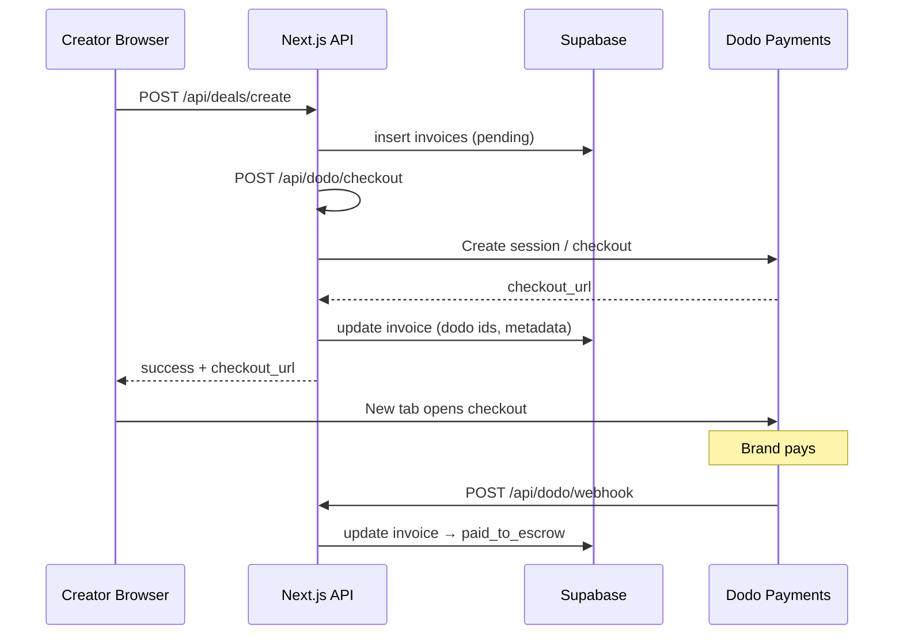

<p align="center">
  <strong>Revifi</strong><br/>
  <span>Creator Finance deals, escrow-style settlement, and instant advances on-chain</span>
</p>

<p align="center">
  
  &nbsp;
  &nbsp;
  &nbsp;
</p>

---
## Pitch Video
https://www.youtube.com/watch?v=DhfRXccPaGc

## Demo Video
https://www.youtube.com/watch?v=xbgHhAsHXek

## What is Revifi?

**Revifi** is a web application for **creators** who work with brands. It treats each sponsorship or campaign as an **invoice (deal)** in your database:

1. **Create a deal** — pick or add a brand, set amount and deadline.
2. **Collect payment** — the app opens a **Dodo Payments** checkout for the brand. Money is tracked as moving into an **escrow-like** state on the invoice (`paid_to_escrow`).
3. **Get paid early** — request an **instant advance** against paid deals. Payouts go to the creator’s **Solana** wallet (real **USDC** when a treasury key is configured; otherwise the flow still records **simulated** transactions for local testing).

Creators sign in with **Google** via **Supabase Auth**. Brands mainly interact through the **checkout link** (opened in a new tab) and a small **payment success** page not a separate full product UI.

---

## Why it exists

- **Single place** to see pipeline value, payment status, and liquidity.
- **Composable stack**: Postgres + Row Level Security, serverless APIs, PCI-sensitive payment flows delegated to **Dodo**, crypto settlement when you enable it.

---

## Feature overview

| Area | What it does |
|------|----------------|
| **Dashboard** | Aggregate stats via RPC (`get_creator_dashboard_stats`), charts (`get_creator_monthly_earnings`), instant-advance entry points |
| **Deals** | Lists invoices with human-readable statuses; **Create Deal** inserts brand row if needed then calls **`/api/deals/create`** and opens **Dodo** checkout via `window.open` |
| **Payments** | Filterable activity; advances and payment-related UX |
| **Wallet** | Balances using **Phantom** RPC + treasury flows; withdrawals with Phantom signing, treasury fallback, or simulated mode |
| **Settings** | Connect **Phantom**, validate Solana address, preferences; Danger Zone triggers account deletion |
| **Support** | Tickets stored in Postgres; optional **Resend** email relay |
| **Search** | Header search hits **`/api/search`** across invoices, transactions, brands, notifications (debounced) |
| **Realtime** | Supabase channels refresh lists when invoices and related tables change (auth-scoped channel names) |

---

## Tech stack

| Layer | Choices |
|--------|---------|
| **Framework** | [Next.js 14](https://nextjs.org/) App Router (`app/`) |
| **UI** | React 18, [Tailwind CSS](https://tailwindcss.com/), [Framer Motion](https://www.framer.com/motion/), Lucide icons |
| **Database & Auth** | [Supabase](https://supabase.com/) (Postgres, RLS, Realtime), [`@supabase/ssr`](https://supabase.com/docs/guides/auth/server-side/nextjs) |
| **Payments** | [Dodo Payments](https://dodopayments.com/) via [`@dodopayments/nextjs`](https://www.npmjs.com/package/@dodopayments/nextjs) |
| **Blockchain** | [Solana Web3.js](https://solana-labs.github.io/solana-web3.js/), SPL Token, optional Anchor dependency in lockfile |

---

## How the main flows fit together



**Instant advance** (simplified):

- **`POST /api/advances/request`** requires invoice status **`paid_to_escrow`**.
- Applies a **5% fee** on the requested advance amount; pays **`finalAmount`** to **`users.solana_wallet`** via **`transferUsdcFromTreasury`** when treasury is configured.
- Updates invoice to **`factored`** and inserts a **`transactions`** row (**`advance`**).

---

## Project structure

```
Revifi/
├── app/
│   ├── api/                      # Route handlers (serverless)
│   │   ├── account/delete/
│   │   ├── advances/request/
│   │   ├── auth/callback/
│   │   ├── deals/create/
│   │   ├── dodo/checkout/       # Dodo Checkout() adapter
│   │   ├── dodo/webhook/       # Verified webhooks → invoice updates
│   │   ├── dodo/portal/
│   │   ├── notifications/mark-read/
│   │   ├── platforms/connect/
│   │   ├── search/
│   │   ├── support/ticket/
│   │   └── wallet/withdraw/
│   ├── brand/payment/success/   # Post-checkout landing for brands
│   ├── creator/                 # Authenticated creator UI (dashboard, deals, wallet, …)
│   ├── layout.tsx
│   └── page.tsx                 # Landing + sign-in entry
├── components/                  # Shared UI (AuthButton, GlobalSearch, …)
├── lib/
│   ├── supabase/                # client.ts, server.ts, admin.ts
│   ├── solana/
│   │   ├── client.ts            # Browser-safe balance + price helpers
│   │   └── server.ts            # Treasury keypair, transfers (server-only)
│   └── phantom.ts
├── middleware.ts                # Refresh Supabase session cookies (SSR pattern)
├── supabase/
│   └── schema.sql               # Idempotent DDL + RLS + RPCs — run in SQL Editor
├── SETUP.md                     # Operational checklist (read this next)
├── tailwind.config.js
└── package.json
```

---

## Prerequisites

- **Node.js** 18+ recommended (aligned with Next 14)
- A **Supabase** project ([supabase.com](https://supabase.com))
- A **Google OAuth** client (for Supabase Auth “Google” provider)
- **Dodo Payments** account, **product ID**, API key, and webhook signing secret for real checkouts

Optional:

- **Solana CLI** and a funded **treasury** keypair for real USDC/SOL payouts
- **ngrok** (or similar) to expose **`/api/dodo/webhook`** during local development
- **Resend** for outbound support emails

---

## Getting started

**1. Install dependencies**

```bash
npm install
```

**2. Environment**

Create **`.env.local`** at the project root. A full variable list lives in **[SETUP.md](./SETUP.md)** (section “Full `.env.local` reference”). Minimum for a functioning dev loop:

| Variable | Role |
|-----------|------|
| `NEXT_PUBLIC_SUPABASE_URL` | Supabase API URL |
| `NEXT_PUBLIC_SUPABASE_ANON_KEY` | Browser + server client (respects RLS) |
| `SUPABASE_SERVICE_ROLE_KEY` | **Server only** — webhooks, auth self-heal, account deletion |
| `NEXT_PUBLIC_APP_URL` | Base URL used when the server calls its own **`/api/dodo/checkout`** (e.g. `http://localhost:3000`) |
| `DODO_PAYMENTS_API_KEY` | Dodo API bearer token |
| `DODO_PAYMENTS_ENVIRONMENT` | `test_mode` or `live_mode` |
| `DODO_PAYMENTS_WEBHOOK_SECRET` | Real signing secret (placeholder is rejected by the app) |
| `DODO_PRODUCT_ID` | One-time product created in Dodo catalog |
| `JWT_SECRET` | Used where the app signs or verifies JWTs |

**Restart `npm run dev` after every `.env.local` change.**

**3. Database**

Paste and run **`supabase/schema.sql`** in the Supabase **SQL Editor**. The script is **idempotent**:

- Creates tables, indexes, triggers, RPCs, and RLS policies
- **`add column if not exists`** heals older databases
- Rebuilds **`notifications`** type constraint safely
- Appends realtime publication entries when missing
- Ends with **`notify pgrst, 'reload schema'`** so PostgREST picks up columns immediately

**4. OAuth**

In Supabase: enable **Google**, set Site URL and redirect URLs as documented in **SETUP.md** (including **`/api/auth/callback`**).

**5. Run**

```bash
npm run dev
```

Open **[http://localhost:3000](http://localhost:3000)**. Use **`/?signin=1`** flow from the landing page for Google sign-in.

---

## NPM scripts

| Script | Command |
|--------|---------|
| Development | `npm run dev` |
| Production build | `npm run build` |
| Start production server | `npm start` |
| Lint | `npm run lint` |

---

## Database model (conceptual)

| Table | Purpose |
|--------|---------|
| **`users`** | Mirrors auth identity; **`solana_wallet`**, **`metadata`**, **`user_type`** |
| **`creators`** | Profile row keyed by **`user_id`** |
| **`brands`** | Counterparties (**`company_name`**, **`industry`**, **`contact_email`**) |
| **`invoices`** | **Deals** — amount, due date, **status lifecycle**, Dodo identifiers, advance fields |
| **`transactions`** | Ledger entries (**payment**, **advance**, **withdrawal**, …) |
| **`notifications`**, **`support_tickets`**, **`withdrawals`**, **`creator_platforms`** | Messaging, support, withdrawals, linked social platforms |

**Invoice status flow** (simplified):

`pending` → (brand pays via Dodo) → **`paid_to_escrow`** → (advance requested) → **`factored`** → … → **`settled`** / **`expired`** / **`cancelled`**

Exact checks and enums are defined in **`supabase/schema.sql`**.

---

## API routes reference

| Method & path | Purpose |
|----------------|---------|
| `POST /api/deals/create` | Auth user; insert **invoice**; call Dodo checkout; return **`checkout_url`** or roll back invoice on failure |
| `GET|POST /api/dodo/checkout` | Dodo **`Checkout()`** handlers (static + session) |
| `POST /api/dodo/webhook` | Validates signature; **`payment.succeeded`** → **`paid_to_escrow`**; merges subscription metadata |
| `POST /api/advances/request` | Eligible **`paid_to_escrow`** invoices; fee; Solana payout; **`factored`** + transaction row |
| `POST /api/wallet/withdraw` | Withdrawal row + Phantom-verified transfer, treasury, or simulated path |
| `POST /api/platforms/connect` | Store platform connection + computed advance limit |
| `POST /api/support/ticket` | Persist ticket; optionally email via Resend |
| `GET /api/search` | Scoped search across main entities |
| `POST /api/notifications/mark-read` | Notification housekeeping |
| `POST /api/account/delete` | Service-role deletion Path for GDPR-style wipe |
| OAuth | `GET` **`/api/auth/callback`** — code exchange + optional **`users`/`creators`** upsert |

---

## Auth & security notes

- **Middleware** refreshes Supabase cookies on navigations so JWTs don’t silently expire (~1 hour) and APIs stop 401-ing.
- **RLS** enforces creator-scoped reads/writes where applicable; **`SUPABASE_SERVICE_ROLE_KEY`** bypasses RLS — use **only on the server**, never expose to the client.
- **`DODO_PAYMENTS_WEBHOOK_SECRET`** rejects the literal placeholder **`your_webhook_secret_here`** to avoid deploying without webhook verification.

---

## Creator UX caveat: checkout opens in a new tab

After a successful deal creation, the app shows an alert then calls **`window.open(checkout_url, "_blank")`**. If “nothing happens,” typical causes:

- **Popup blocker** on your browser blocking the **second tab**
- **No `checkout_url`** in the response (check browser Network tab → **`/api/deals/create`** payload and error messages)

---

## Solana modules

| File | Use |
|------|-----|
| **`lib/solana/client.ts`** | Safe in browser: balances, **`isValidSolanaAddress`**, live SOL USD via CoinGecko |
| **`lib/solana/server.ts`** | Treasury keypair parsing, **`transferUsdcFromTreasury`**, **`transferSolFromTreasury`**, transaction verification |

---

## Acknowledgements

Built with **[Next.js](https://nextjs.org/)**, **[Supabase](https://supabase.com/)**, **[Dodo Payments](https://dodopayments.com/)**, and **[Solana](https://solana.com/)**.

---
